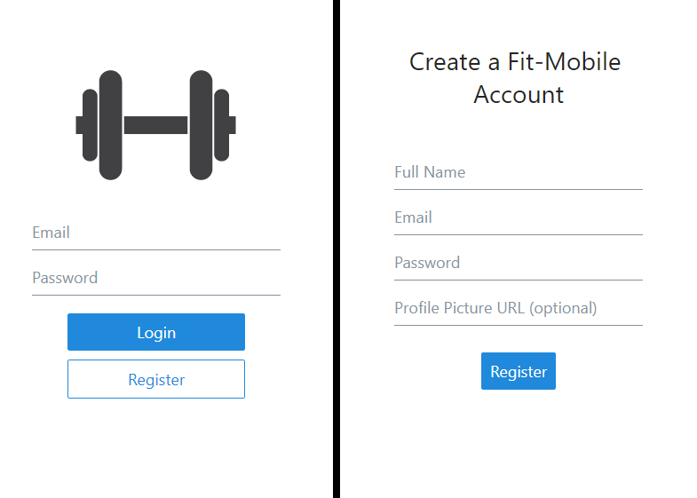

# fitness-mobile

Fitness App created with React Native intended to track workouts and calories, and create workout and diet plans.

## Featuring...

### User Authentication (Register & Login)

### Exercise Journal

Allows users to add and delete exercises throughout a workout session.

### Exercise Planner

Allows users to view & save plans created by others, or create their own plans. 

