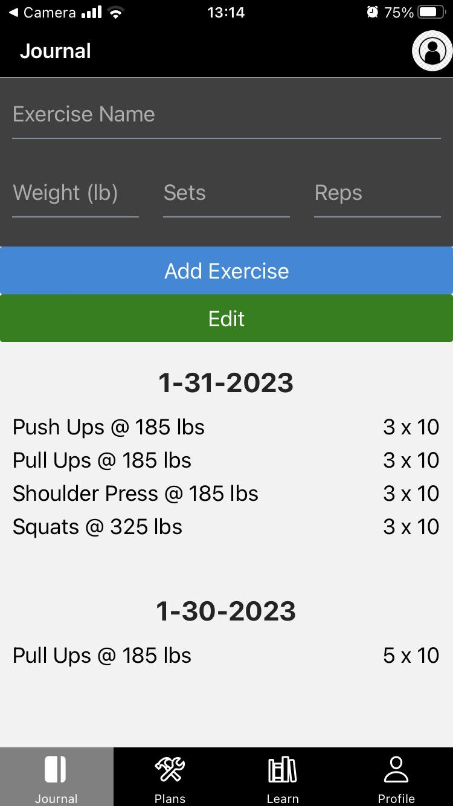
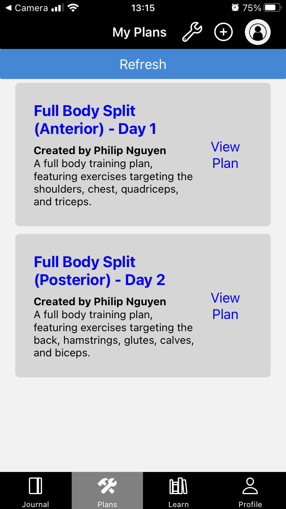

# fitness-mobile

Developed with React Native, this app gives users access to tools to create exercise plans and track their implementation of the plan.

## Featuring...

### User Authentication (Register & Login)

### Exercise Journal

Allows users to add and delete exercises throughout a workout session.

### Exercise Planner

Allows users to view & save plans created by others, or create their own plans. 

